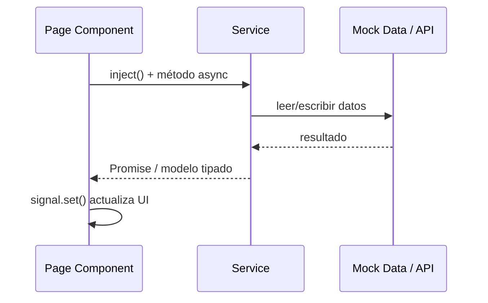
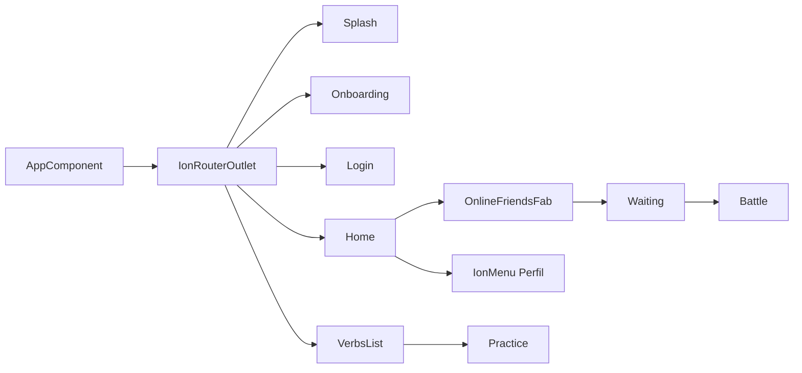
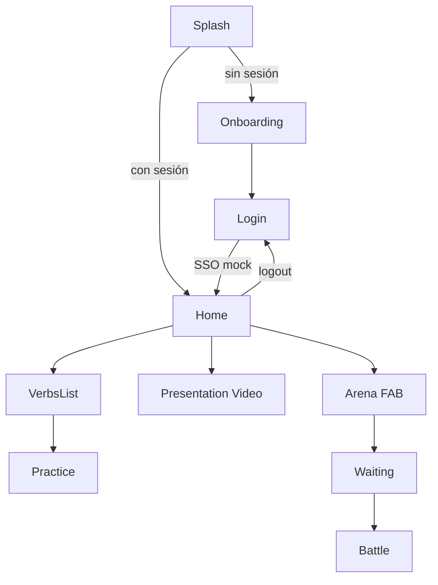

# Arquitectura

## Visión general

Miri Verbs Ionic sigue **Feature-First Clean Architecture**, replicando la estructura conceptual de la app Flutter original pero adaptada a Angular standalone + Ionic.

```mermaid
graph TB
    subgraph Presentation["Capa de Presentación"]
        Pages["Pages / Components<br/>(features/*/)]
        Widgets["Widgets reutilizables<br/>(core/widgets/)"]
    end

    subgraph Domain["Capa de Dominio"]
        Models["Models / Interfaces<br/>(core/models/)"]
        Theme["Design Tokens<br/>(core/theme/)"]
    end

    subgraph Data["Capa de Datos"]
        Services["Services<br/>(core/services/)"]
        MockData["Syllabus + Mock State<br/>(core/data/)"]
    end

  Pages --> Services
  Pages --> Widgets
  Pages --> Theme
  Services --> Models
  Services --> MockData
```

## Tecnologías utilizadas

| Capa | Tecnología |
|------|------------|
| Framework UI | Ionic 8 |
| Framework app | Angular 20 (standalone) |
| Estilos | SCSS + Ionic CSS variables |
| Estado local | Angular Signals |
| Async | RxJS (mínimo), Promises en servicios |
| Routing | Angular Router (lazy `loadComponent`) |
| Mobile (futuro) | Capacitor 8 |
| Backend (futuro) | Supabase + Firebase FCM |

## Flujo de datos



### Ejemplo: Práctica de verbos

1. `VerbsListPage` llama `VerbService.getVerbsForSublevel()`
2. Navega a `PracticePage` con verbos en `history.state`
3. `PracticePage` genera quiz localmente
4. Al terminar, `ProgressService.completePractice()` actualiza mock
5. `ToastService` muestra feedback si aplica

## Estructura de carpetas

```
miri-verbs-ionic/
├── .ai/                    # Contexto para IA
├── tasks/                  # Seguimiento de tareas
├── docs/                   # Documentación técnica
├── src/
│   ├── app/
│   │   ├── core/
│   │   │   ├── data/           # syllabus.data.ts
│   │   │   ├── models/         # Interfaces TypeScript
│   │   │   ├── services/       # Lógica de negocio (mock)
│   │   │   ├── theme/          # app-theme.ts tokens
│   │   │   └── widgets/        # Componentes UI compartidos
│   │   ├── features/
│   │   │   ├── splash/
│   │   │   ├── onboarding/
│   │   │   ├── auth/login/
│   │   │   ├── home/
│   │   │   ├── verbs/
│   │   │   └── multiplayer/
│   │   ├── app.component.ts
│   │   └── app.routes.ts
│   ├── assets/images/      # Mascots, logo
│   ├── theme/variables.scss
│   └── global.scss
└── www/                    # Build output
```

## Comunicación entre componentes



| Mecanismo | Uso |
|-----------|-----|
| **Router** | Navegación entre pantallas |
| **queryParams** | Título unidad, level, sublevel |
| **history.state** | Pasar verbos a PracticePage |
| **Services (singleton)** | Estado auth, progress, config |
| **Signals** | Estado local reactivo en componentes |
| **Outputs** | `TactileButton (tapped)` |
| **IonModal** | Avatar picker, detalle verbo, arena FAB |
| **localStorage** | Sesión mock persistente |

## Navegación



## Widgets core

| Widget | Selector | Equivalente Flutter |
|--------|----------|---------------------|
| TactileButton | `app-tactile-button` | `TactileButton` |
| SquishyProgressBar | `app-squishy-progress-bar` | `SquishyProgressBar` |
| GoogleLogo | `app-google-logo` | `GoogleLogo` |
| Toast | `ToastService` | `FeedbackToast` |
